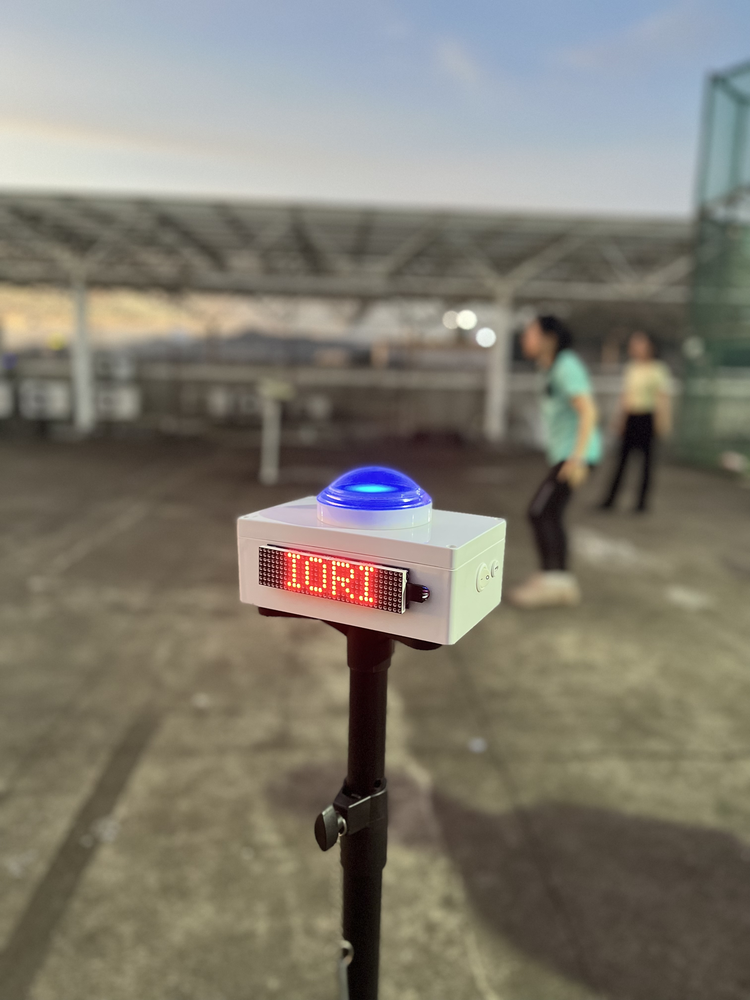
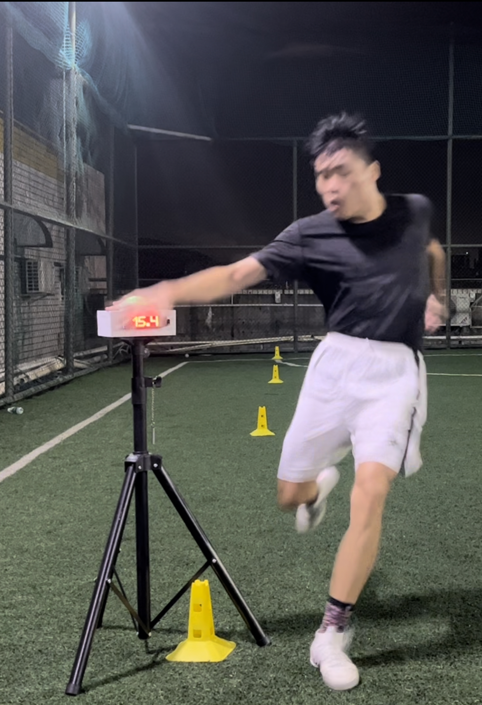

<iframe src="//player.bilibili.com/player.html?aid=869690015&bvid=BV1gV4y1m7gZ&cid=1160527184&page=1&high_quality=1" scrolling="no" border="0" frameborder="no" framespacing="0" allowfullscreen="true" style="position: absolute; width: 100%; height: 100%; left: 0; top: 0;"> </iframe>

<!-- 

 -->

::: slot footer
Copyright © 2021-2023 一起踢足球训练营
:::
