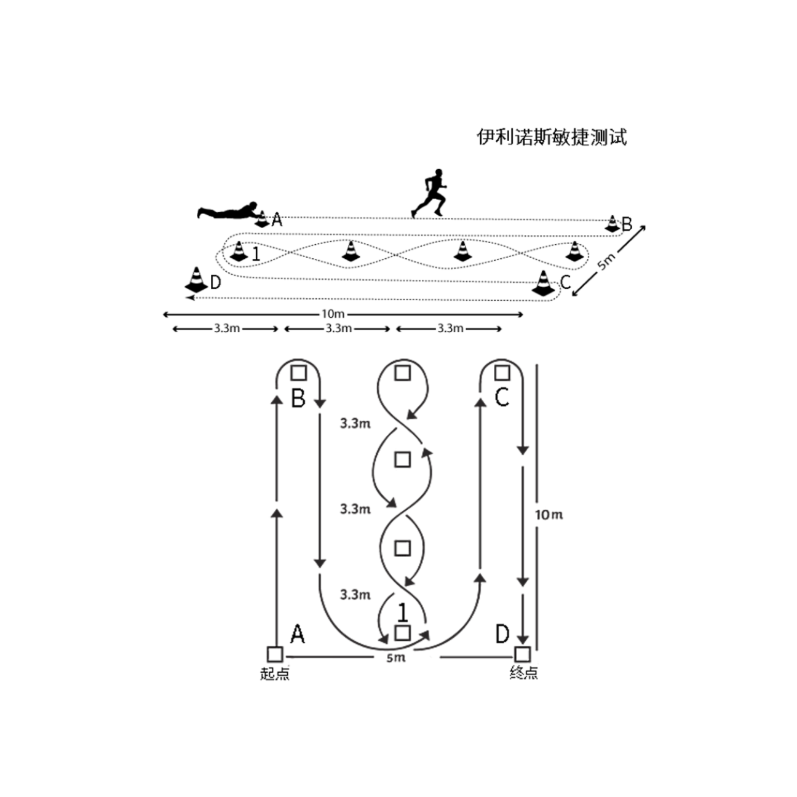

# 飞盘

Ultimate Frisbee（极限飞盘）是一项严格要求无身体碰撞的团队竞技运动，融合了橄榄球、足球和篮球等运动特点。正式比赛主要为七人制，在 100m * 37m 规格的场地上进行，赛场两侧各有一块 18m*37m 的得分区域，进攻方通过各种战术方式的跑动、传递飞盘，让队友们在攻入得分区接盘得分。这是一项有门槛，但又极具挑战与观赏的对抗型竞技运动。为了赢得比赛，参与的选手必须要具备优秀的体能、快速的移动、敏锐的判断以及稳定的控盘技巧。

## T 字折返跑

测试要求：

- 着装轻便并充分热身，确保测试环境安全。
- 运动员从 A 处起点开始向前跑，抵达 B 点后向右侧滑步移动至 C 点，抵达后向左侧滑步移动至 D 点，抵达后向右侧滑步移动回到 B 点，抵达后倒退跑至 A 点，测试结束。
- 受试者需分别完成两次测试，取最高值并记录，单位为秒，精确到小数点后 2 位。
- 身体应该始终面向前方，不要用交叉步，脚步交叉或者手没触碰到标志桶则不合格。

## 30 米跑

场地要求：平坦的场地。
所需器材：皮尺，电子测试门或秒表，标志桶或杆（标记起点、中间点及终点）。
测试要求：

- 着装轻便并充分热身，确保测试环境安全。
- 站立式起跑，用最快速度完成 30m 距离。
- 每名运动员测试 2 次，取最好成绩，同时记录 5、10、20m 成绩作为参考。计量单位为秒，精确到小数点后 2 位。

## 伊利诺斯灵敏跑

场地要求：平坦的场地。
所需器材：标志桶 8 个、皮尺 1 条、电子测试门或秒表。

- 着装轻便并充分热身，确保测试环境安全。
- 运动员从 A 处起点俯卧，听到口令后开始跑向 B，抵达 B 点后跑向标志桶 1 并完成 U 形转弯，反向从 C 跑至 D，测试结束。
- 受试者需分别完成两次测试，取最高值并记录，单位为秒，精确到小数点后 2 位。
- 测试路线错误则该次不计成绩。

