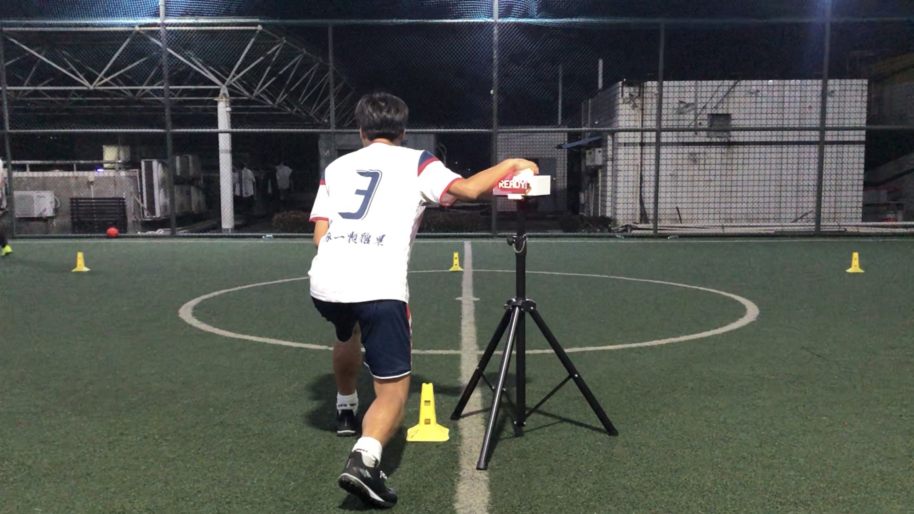

<iframe src="https://www.youtube.com/embed/DLObx4Fq8FI" scrolling="no" border="0" frameborder="no" framespacing="0" allowfullscreen="true" style="position: absolute; width: 100%; height: 100%; left: 0; top: 0;"> </iframe>

<!-- 
 -->
<!--  -->
<!--  -->
<!--  -->
<!--  -->
<!-- 
 -->

::: slot footer
Copyright © 2021-2023 Yiqiti Football Camp
:::
