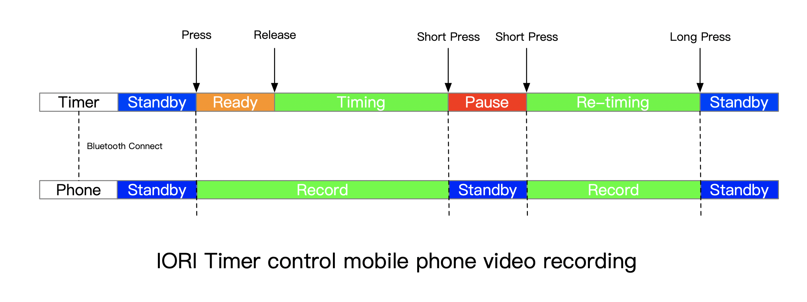
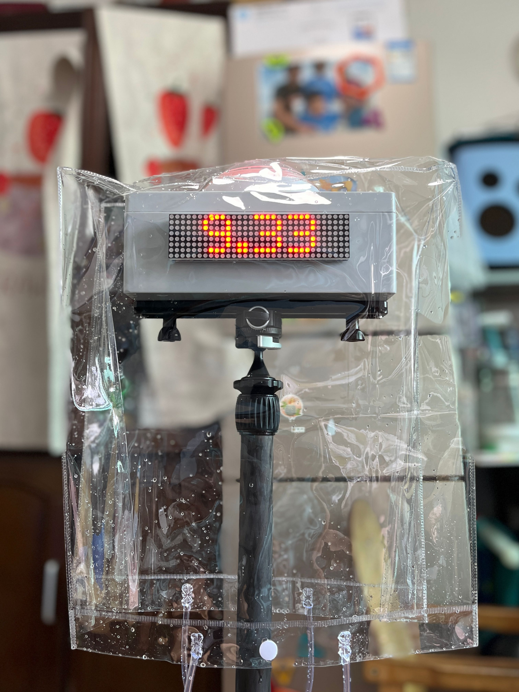

# Guide

## Introduction

The IORI timer is a simple and easy to use that can quickly assist coaches in completing test evaluations of team members and can also be a powerful tool to individual training.

### Why do it

I personally run a non-profit football camp for adults that we train once a week. I also work as a part-time weekend coach for some youth clubs. There is always the problem of how to evaluate the players in the long-term training.

> Evaluation tests, which involve practical exercises designed specifically to obtain the most precise and objective data possible from the basic game components forming part of the teaching content. This type of evaluation is also known as the quantitative method.  
> -- UEFA Fusal Coaching Manual

Evaluation is an essential part of training, so do we have tools to use?

#### Why Not...?

#### Stopwatch

Stopwatches, including mobile phones and sports watches, have timing functions. But there are two disadvantages. You need someone to help you set the watch. Second, there are certain errors in the beginning and end of the hand pinch. We can replace the function of a stopwatch that can be completely replaced, and the time is visible and easy to video record.

#### Infrared/laser timer

To judge the beginning and end by a non-contact way is indeed the most accurate way at present, and does not affect sports performance at all. However, its price is also very expensive, the equipment is not convenient to carry, and the operation threshold of the equipment is relatively high. Our operation is much simpler, even the children can fully master.

### IORI timer advantage

- Only one button, not as many buttons as a stopwatch
- Only one person to complete the test, no assistance, one person to do the work of two people
- Connect mobile phone, remote synchronization control video recording, segment recording, easier to organize
- Create a competitive training culture that improve athletic performance for all

## Getting Started

1. Turn on the Power switch on the right, the IORI logo will be displayed on the screen, and the button light is blue.
2. Press and hold the button. The READY sign is displayed on the screen and the button light is yellow.
3. Release the button to start the timing immediately. The screen shows the stopwatch timing, and the button light is green.
4. Press the button again to stop the timer. The screen displays the duration time, and the button light is red.
5. Long press the button to enter the ready state again. The button light will turn blue and then orange.
6. Or press short to continue timing, and the button light will display green again.

[Operation Video](https://www.instagram.com/p/ChpD4SrAQOn/)

## Connect your phone to automatically record video

1. Start the IORI timer
2. Open the Bluetooth of the mobile phone and search the device name "IORI" to connect
3. Open the Camera application and select VIDEO
4. Press and hold the button to start counting, and video will start video recording
5. Release the button to continue recording
6. Press the IORI button again to stop video recording

[Remote Control for iPhone/Android Video](https://www.instagram.com/p/ChpEZSDAY84/)

::: tip
With the mobile phone tripod, it is convenient to record the movements of the team members one by one.
:::

::: tip
After the connection is successful, it will be automatically connected every time the machine starts up. If you want to connect to another phone, you need to disconnect this phone or it's out of connection range.
:::

## Connect your phone to take a selfie

1. Start the IORI timer
2. Open the Bluetooth of the mobile phone and search for the device name "IORI" to connect
3. Open the Camera application and select PHOTO
4. Press and hold the IORI button and release it
5. Short Press the IORI button continuously. Each time you short press it, it is a snapshot

::: tip
This is perfect for the post-training group photo with Use a mobile phone tripod.
:::

## Install to the tripod

### Speaker Stand (Recommended)

35mm thick adjustable steel tripod, Suitable for fixed place use. Not easy to tip over when press or tap. Such as [Amazon Basics Adjustable Speaker Stand - 4.1 to 6.6-Foot, Steel](https://a.co/d/imwDcyr)

Easy install, Just use the included tray and lock the four corners. Then you can lock it on a tripod.

### Camera Tripod

When you go out to use, a light tripod is a must, here recommend carbon fiber tripod, one is light weight, the second is strong.

**Lightweight and robust carbon fiber tripod (Recommended)**

Installation:

1. Lock the quick release plate to the bottom of the timer
2. Use a tripod head or 1/4 screw to fix
3. Check the diagram below

**Cheap aluminum tripod (Not recommended)**

Cheap aluminum tripod because of poor bearing capacity, easy to instability.

Installation:

1. Lock the quick release plate to the bottom of the timer
2. Use a 1/4 screw to fix
3. Check the diagram below

## How waterproof

The timer itself is not currently waterproof. If it is rained on, rain will seep into the button and other places, which will seriously shorten the product life. To this end, we offer simple waterproof bags that can be used on rainy days.

## Charging instructions

Use the USB Type-C to charge the device while **turning on the power switch**.  
After the actual test, it takes **10 hours** to fully fill, and full can be used for **19 hours**.

About 1 hour of charging and 2 hours of use.

::: tip
You can use a timer to record the charging time.
:::

::: danger Not supported
Apple chargers are not supported
:::

## Official sales channel

The product is officially on sale now. I would love to hear feedback from all over the world. The package includes Timer x1, Quick Release Plate x1, Tripod Tray x1, Waterproof bag x1.

| Item                                                                   | Link                                                                                                                  |
| ---------------------------------------------------------------------- | --------------------------------------------------------------------------------------------------------------------- |
| Timer x1 + Quick Release Plate x1 + Tripod Tray x1 + Waterproof bag x1 | [Amazon](https://a.co/d/g2VKhQx)                                                                                      |
| Tripod                                                                 | [Amazon Basics Adjustable Speaker Stand](https://a.co/d/0aRU0kz) or [5 Core PA Speaker Stand](https://a.co/d/9arTzGT) |

If it is not possible to purchase from Amazon in your country, please contact me, pay with Paypal and I will ship for you separately.

### Product Price

| Package                                                                | Cost   |
| ---------------------------------------------------------------------- | ------ |
| Timer x1 + Quick Release Plate x1 + Tripod Tray x1 + Waterproof bag x1 | US$ 70 |

### Shipping & Taxes

I want to keep shipping costs to a minimum. This is the best price I can get at the moment.

| Region       | Cost      |
| ------------ | --------- |
| USA&CANADA   | US$ 12.00 |
| UK&IRELAND   | US$ 13.00 |
| EUROPE       | US$ 13.00 |
| AUSTRILA     | US$ 12.00 |
| NEWZEALAND   | US$ 12.00 |
| REST OF ASIA | US$ 12.00 |
| OTHER        | US$ 20.00 |

You will be responsible for paying local Tax and duties when applicable. You will not always be required to pay duties or import tax, but it is important that you make yourself aware of the duties that apply in your country in case you are charged.

## Classic Test

The IORI timer performs all tests with consistent start and end points. Such as shuttle run, T-test and so on. When we design our training program, we try to have the same start and end point. In addition, the IORI timer can be used to test time challenges, such as the maximum time to juggle continuously and the time to plank.

Of course, we can also just take it as a mobile phone remote controller, with mobile phone and mobile phone tripod, can be very convenient for training video recording.

### T-test

The T-test includes accelerate, decelerate, shuffle, and backward, which are the basic movements required in football. Standard movement, and shorter completion time, the stronger the athletic ability.

[T test video](https://www.instagram.com/p/CgziY7tAAVw/)

### 60 ball juggling challenge

The time it takes to complete 60 ball juggle. Drop the ball can be picked up to continue, the number continues to accumulate until the number of 60.

### Contact Us

You can contact me on Facebook Messager or Email.

<!-- I'd like to better understand your needs. Please fill out this registration form [Register](https://forms.gle/Rt7e3TRPQyjXVVxJ9). Then contact me with facebook messenger. -->

- Facebook Page: [https://www.facebook.com/ioritimer](https://www.facebook.com/ioritimer)
- Email: <awong1900@163.com>

<!-- Paypal link: [https://paypal.me/awong1900](https://paypal.me/awong1900) -->

## About Us

The product is designed by [Shenzhen Yiqiti Football Camp](https://zuqiuxunlian.github.io/en/) team.

Many thanks to Coach Lu, Juca Grajau (Brazil) of Shenzhen FC116 Club, Coach Yang Bin of Shenzhen Rangers Club, Coach Xu Jianning of Xiamen City, Coach Yang of Wuhan Huangbei Jianxiao Club, and Coach Zhao of Football Salon. Many helpful suggestions were given during development and testing.
