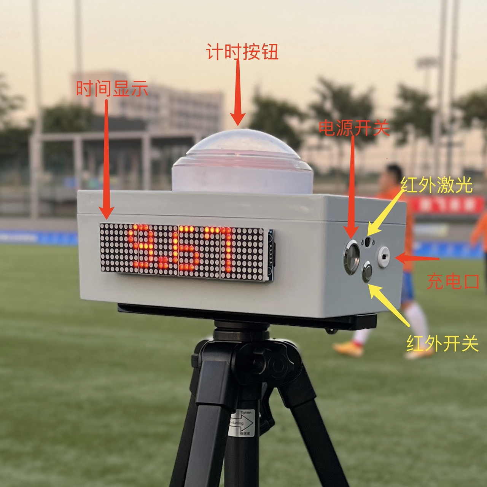
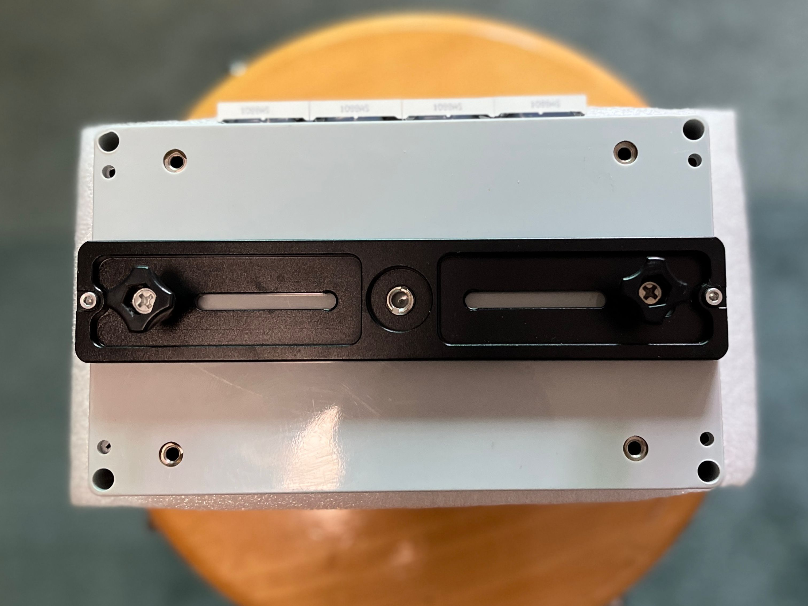
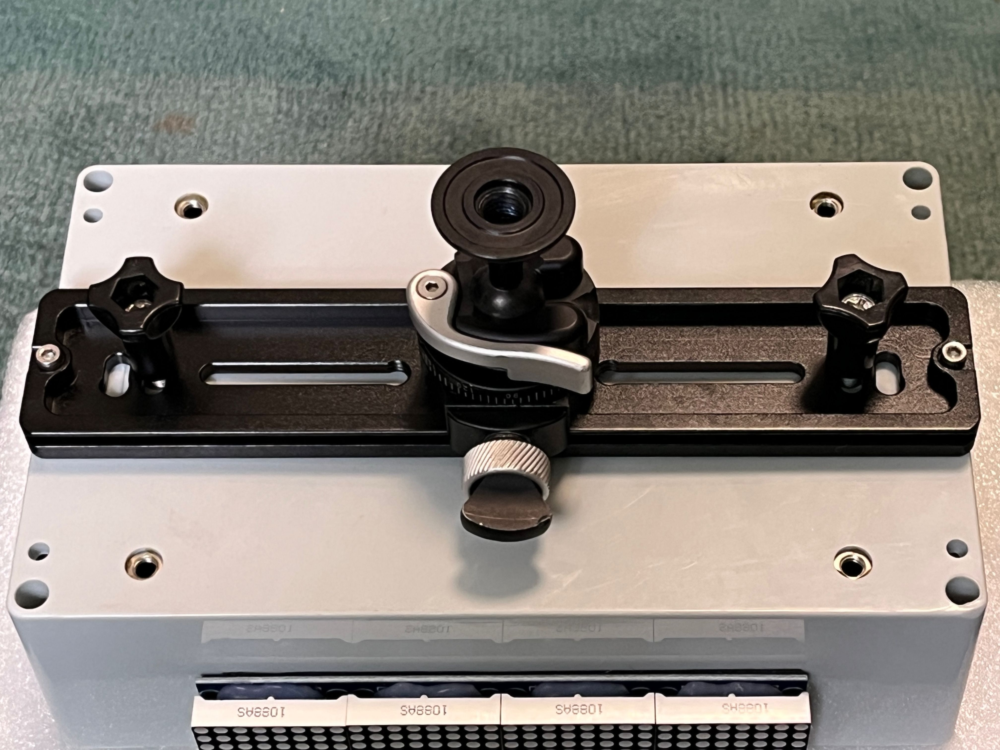

# 指南

## 介绍

IORI 计时器是一个简单易用的计时器，可以快速协助教练完成队员的测试评估，也可以作为个人训练的强大辅助工具。

### 为什么做

我们团队组织了一个非营利的成人足球训练营，会保持一周一练，同时我们也会给一些青训俱乐部做教练。在长期的训练中发现一直存在如何评估队员的问题。以下引用欧足联教练手册对于评估的定义。

> Evaluation tests, which involve practical exercises designed specifically to obtain the most precise and objective data possible from the basic game components forming part of the teaching content. This type of evaluation is also known as the quantitative method.  
> 评估测试，指为从构成教学内容的基本游戏内容中获得最精确、最客观的数据而专门设计的实践练习。这种类型的评估也被称为定量方法。  
> —— UEFA Fusal Coaching Manual

常见的评估测试包括体能测试如 T 字测试、5-10-5 敏捷测试、30 米冲刺等。我们也可以根据自身的项目特点创建适合的评估测试项目。因为评估是训练中必不可少的一环，那我们有没有趁手的工具呢？

### 为什么不是...?

#### 秒表/手机

秒表包括手机、运动手表等都有计时功能。但是有两个缺点，第一，需要人协助去启停计时。第二，结果不易于展示和分享。

#### 激光计时器

常规计时器大都需要反射板，设置复杂。第二个是缺少手按的启动方式，在测试 40 码冲刺等项目时无法反映准确的时间。

### IORI 计时器的特点

- 操作简单，幼儿园小朋友都会使用
- 无反射板设计，开机即用
- 互联互通，可分开单独使用，也可组合使用
- 手机控制器，一键同步录制视频
- 多种场合，敏捷测试、体育单招、比赛计时等

## 快速开始

<!--  -->

1. **长按松手**开始
2. 再次按下结束
3. 重新**长按松手**，清零并重新开始

<!-- 【IORI计时器快速操作指南】 https://www.bilibili.com/video/BV1Aj411X78K -->

<iframe src="//player.bilibili.com/player.html?aid=444703015&bvid=BV1Aj411X78K&cid=1160533141&page=1&high_quality=1" scrolling="no" border="0" frameborder="no" framespacing="0" allowfullscreen="true" style="position: absolute; width: 100%; height: 100%; left: 0; top: 0;"> </iframe>

手按操作

## 红外触发

打开红外开关后，听到滴的一声，红外设置完成。正常开放无阻挡情况，距离最远限制在 1.3 米。队员通过自动时触发开始或者结束。可以手按开始，触发结束组合使用。

::: tip 室内和晚上效果最好
红外会受阳光的干扰，在白天，直射和散射的光线会导致检测距离变短。如果发现检测距离小于 1m，请改用手按开始和结束。
:::

## Twins 互联

任何两个计时器都可以组合在一起，形成一组双胞胎设备。它们的行为将会完全一致，当其中一个开始，另一个也会开始，结束同理。所以我们可以把一个放在起点，另外一个放在终点，用于测试 30 米，60 米，100 米等速度测试。

实际测试，双胞胎设备的无遮挡互联距离可以达到 150 米以上，完全满足田径场的任何需求。

**设置步骤：**

1. 按住计时按钮不放，然后按下电源开关，开机进入设置模式。
2. 松开计时按钮，短按翻到 S.TWIN
3. 长按计时按钮，进入互联小组选择
4. 短按切换 A 组、OFF（关闭互联）、B 组、...、G 组
5. 长按确认选择
6. 当 2 台设备处于同一小组时，会自动连接
7. 开机显示中可查看小组里有多少个设备

::: tip 组成三胞胎甚至四胞胎
我们可以把更多的设备连接在一起，比如在在 60 米测试中增加 30 米的计时点。最多可以组 6 个设备。
:::

## 自动录像

1. 打开 IORI 计时器
2. 打开手机的蓝牙，搜索设备名为 "IORIxxx" 连接
3. 打开手机拍照界面，选择视频
4. 按住 IORI 按钮，视频录制开始
5. 松开 IORI 按钮，视频录制继续
6. 再次按下 IORI 按钮，视频录制停止

<!-- [控制手机录像操作视频](https://www.bilibili.com/video/BV1vU4y1r7K5) -->

<iframe src="//player.bilibili.com/player.html?aid=687092505&bvid=BV1vU4y1r7K5&cid=803477016&page=1&high_quality=1" scrolling="no" border="0" frameborder="no" framespacing="0" allowfullscreen="true" style="position: absolute; width: 100%; height: 100%; left: 0; top: 0;"> </iframe>

::: tip 提示
连接成功后，以后每次开机都会自动连接。如果你想连接到另外一部手机，需要断开这台手机的连接或者这台手机不在连接范围内。
:::

## 使用支架

### 专用三脚架

适合固定场所使用

- 35mm 粗加厚伸缩型三角架，短款支持 62-120mm，长款支持 100-180mm。
- 非常适合固定训练场使用，拍按时不易翻倒，坚固耐用。
- 安装非常简单，只需要取下**托盘**，然后锁住四个角即可。

### 便携三脚架

当你外出使用时，一个轻便的三脚架是必须的，使用快装板可以快速安装。

#### 轻便坚固的碳纤维三脚架（推荐）

安装步骤：

1. 锁住快装板到计时器底部
2. 使用云台固定快装板
3. 查看下面示意图

## 如何防水

目前计时器本身还不支持防水。如果被雨淋，从按钮等地方会渗进雨水，会严重缩短使用寿命。为此，可以使用透明的塑料袋盖住，避免雨水浸入。如果有渗入雨水，请倒置放置挥发风干。

## 充电指导

使用 Type-C 接口充电器给设备充电，充电时必须同时**把电源开关打开**。  
经过实际测试，完全充满需要 10 小时，充满可以使用 15 小时。

::: tip 小技巧
可以使用计时器记录充电时间。
:::

## 经典测试

IORI 计时器可以完成所有的起点和结束点一致的测试。比如折返跑、T 字测试等。我们设计训练项目时，尽量安排起点和终点一致。另外 IORI 计时器可以完成时间挑战的测试，比如连续颠球最长时间、平板支撑时间等。

当然，我们也可以仅仅把它当作一个手机远程控制器，配合手机及手机三脚架，可以很方便的对训练进行视频记录。

### T 字测试

T 字测试包含冲刺、减速、横向侧滑步、后退等步伐动作，这些是足球所需要的步伐。动作标准，完成时间越短，证明有更强的运动能力。

<!-- [T 字测试指导](https://www.bilibili.com/video/BV1p34y187aF?share_source=copy_web&vd_source=5211f4704c635d72a56e387a10a3f656)

[T 字测试合集](https://www.bilibili.com/video/BV16a411M7ko?share_source=copy_web&vd_source=5211f4704c635d72a56e387a10a3f656) -->

<iframe src="//player.bilibili.com/player.html?aid=809672045&bvid=BV1p34y187aF&cid=549031180&page=1&high_quality=1" scrolling="no" border="0" frameborder="no" framespacing="0" allowfullscreen="true" style="position: absolute; width: 100%; height: 100%; left: 0; top: 0;"> </iframe>

T 字测试指导

 

<iframe src="//player.bilibili.com/player.html?aid=899525712&bvid=BV1ZN4y1G7u7&cid=805073937&page=1&high_quality=1" scrolling="no" border="0" frameborder="no" framespacing="0" allowfullscreen="true" style="position: absolute; width: 100%; height: 100%; left: 0; top: 0;"> </iframe>

IORI T 字测试

### 平板支撑挑战

1. 将计时器放置在胸口下，压住准备
2. 撑起开始计时
3. 力竭时再次按压结束计时

<iframe src="//player.bilibili.com/player.html?aid=955793883&bvid=BV1ZN4y1G7u7&cid=1192170601&page=1&high_quality=1" scrolling="no" border="0" frameborder="no" framespacing="0" allowfullscreen="true" style="position: absolute; width: 100%; height: 100%; left: 0; top: 0;"> </iframe>

平板支撑挑战

<iframe src="//player.bilibili.com/player.html?aid=360677413&bvid=BV1ZX4y1H72n&cid=1189948751&page=1&high_quality=1" scrolling="no" border="0" frameborder="no" framespacing="0" allowfullscreen="true" style="position: absolute; width: 100%; height: 100%; left: 0; top: 0;"> </iframe>

平板支撑团队挑战

### 足球综合测试

1. 连续触球 30 次的时间
2. 颠球 30 次的时间
3. 4 个碟子折返跑（无球）
4. 4 个碟子折返跑（带球）

<iframe src="//player.bilibili.com/player.html?aid=857066330&bvid=BV1tV4y1s7jB&cid=805494948&page=1&high_quality=1" scrolling="no" border="0" frameborder="no" framespacing="0" allowfullscreen="true" style="position: absolute; width: 100%; height: 100%; left: 0; top: 0;"> </iframe>

<!-- ## 官方购买渠道

我们已正式在各大平台进行销售。

- 淘宝：[https://item.taobao.com/item.htm?ft=t&id=687250935119](https://item.taobao.com/item.htm?ft=t&id=687250935119)
- 京东：[https://item.jd.com/10080379147451.html](https://item.jd.com/10080379147451.html) -->

<!-- ## 样品试用

如果你是带队的教练，无论您是社区教练还是青训教练，都可以申请样品试用。只需填写申请表，提供带队照片即可。

[【腾讯文档】IORI 计时器教练试用申请表](https://docs.qq.com/form/page/DUmFoaXlCQnZQU3Zz) -->

## 我们的部分客户

英国德比郡梯队、深圳绿茵场青训、星未来流浪者、北师大深圳（小升初足球特长生选拔）、赣州消防局等。

## 关于我们

产品由深圳[一起踢足球训练营](https://zuqiuxunlian.com)团队设计。联系人：王教练（微信 awong1900）。

非常感谢：深圳 FC116 俱乐部 卢教练、Juca Grajaú（巴西）、深圳流浪者教练 杨斌、厦门教练 许建宁、武汉黄陂剑箫 杨教练、足球教练沙龙 赵瑞田，深圳 f2soccer 申成男，上海国金综合体能中心 橄榄球教练 Magic，在开发和测试过程中给了很多有益的建议。

<!-- ## 反馈您的建议

[填写反馈](https://support.qq.com/product/422185) -->
