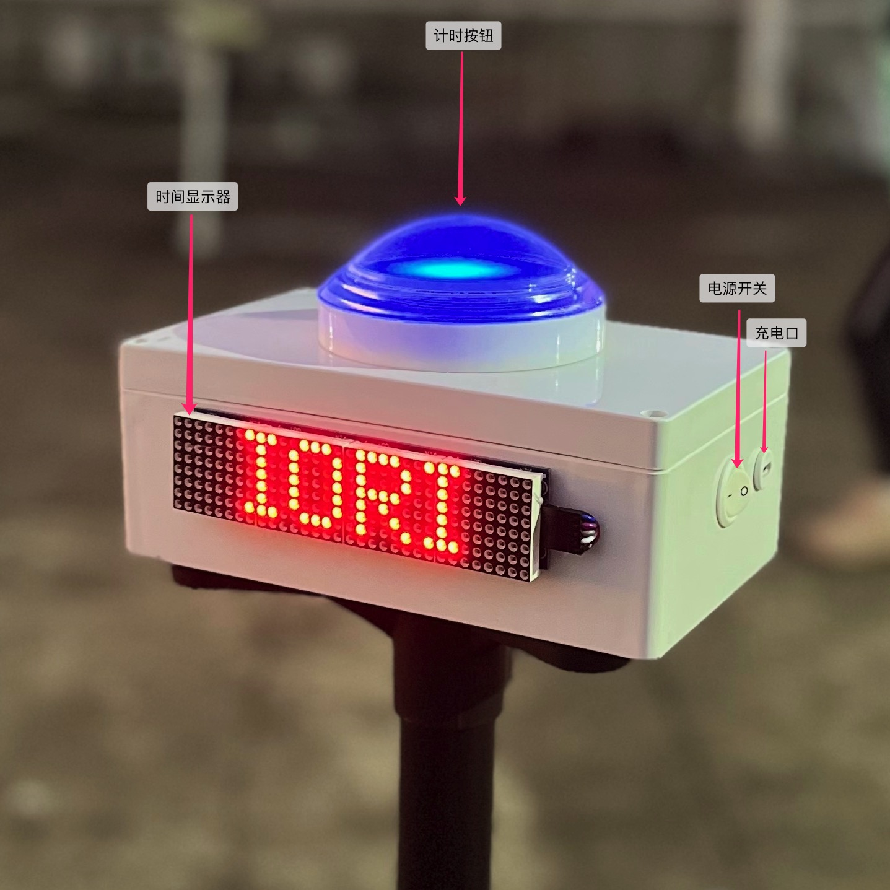

# 指南

## 介绍

IORI 计时器是一个简单易用的计时器，可以快速协助教练完成队员的测试评估，也可以作为个人训练的强大辅助工具。

### 为什么做

我个人是组织了一个非营利的成人足球训练营，会保持一周一练。另外会给一些青训俱乐部做周末兼职教练。在长期的训练中一直存在如何评估队员的问题。

> evaluation tests, which involve practical exercises designed specifically to obtain the most precise and objective data possible from the basic game components forming part of the teaching content. This type of evaluation is also known as the quantitative method.
>
> 评估测试，指为从构成教学内容的基本游戏内容中获得最精确、最客观的数据而专门设计的实践练习。这种类型的评估也被称为定量方法。
>
> —— UEFA Fusal Coaching Manual

评估是训练中必不可少的一环，那我们有没有趁手的工具呢？

### 为什么不是...?

#### 秒表

秒表包括手机、运动手表等都有计时功能。但是有两个缺点，需要人协助去掐表。第二，手掐的开始和结束都有一定的误差。如果是做一个粗略的计时，它是一个好选择。

#### 红外/激光计时器

通过无接触的方式去判断开始和结束，确实是目前最精准的方式，完全不影响运动表现。但是它价格也是非常的贵，相对操作也是有些门槛。如果你是自行车，摩托车计时这是唯一的选择。

### IORI 计时器的特点

- 只有一个按钮，没有秒表那么多按钮，无从下手
- 只用一个人完成测试，无需协助，一人完成两人的工作
- 连接手机，远程同步控制录制视频，分段记录，更容易整理
- 创造竞争的训练氛围，促进提高所有人的运动表现

## 快速上手

1. 打开右侧开关，屏幕随即显示 IORI 标志，按钮灯为蓝色。
2. 长按按钮，屏幕显示为 READY 标志，按钮灯为黄色。
3. 松开按钮，立即进入计时。屏幕显示秒表计时，按钮灯为绿色。
4. 再次按下按钮，停止计时。屏幕显示时长，按钮灯为红色。
5. 长按按钮，重新进入准备状态，按钮灯会变为蓝色再变为橙色。
6. 或者短按，则继续计时，按钮灯重新显示绿色。

[操作视频](https://www.bilibili.com/video/BV1fv4y1F7oB)

## 连接手机自动录像

1. 打开 IORI 计时器
2. 打开手机的蓝牙，搜索设备名为 "IORI" 连接
3. 打开手机拍照界面，选择视频
4. 按住 IORI 按钮，视频录制开始
5. 松开 IORI 按钮，视频录制继续
6. 再次按下 IORI 按钮，视频录制停止

::: tip
连接成功后，以后每次开机都会自动连接。如果你想连接到另外一部手机，需要断开这台手机的连接或者这台手机不在连接范围内。
:::

## 连接手机自拍

1. 打开 IORI 计时器
2. 打开手机的蓝牙，搜索设备名为 IORI 连接
3. 打开手机拍照界面
4. 按住 IORI 按钮，松开
5. 连续短按 IORI 按钮，每次按下就是一次抓拍

## 安装到三脚架

1. 从三脚架上取下托盘
2. 把 IORI 计时器放置在托盘
3. 使用附送的螺丝从下面锁紧

## 充电指导

正常情况，电池充满，可以连续使用 10 小时（电池可能有损耗，影响使用寿命）。

充电使用 Type-C 充电接口进行充电，5V1A 的充电器充满需要 3 小时。充电时默认开启工作。

## 经典测试

IORI 计时器可以完成所有的起点和结束点一致的测试。比如折返跑、T 字测试等。我们设计训练项目时，尽量安排起点和终点一致。另外 IORI 计时器可以完成时间挑战的测试，比如连续颠球最长时间、平板支撑时间等。

当然，我们也可以仅仅把它当作一个手机远程控制器，配合手机及手机三脚架，可以很方便的对训练进行视频记录。

### T 字测试

T 字测试包含冲刺、减速、横向侧滑步、后退等步伐动作，这些是足球所需要的步伐。动作标准，完成时间越短，证明有更强的运动能力。

[T 字测试指导](https://www.bilibili.com/video/BV1p34y187aF?share_source=copy_web&vd_source=5211f4704c635d72a56e387a10a3f656)

[T 字测试合集](https://www.bilibili.com/video/BV16a411M7ko?share_source=copy_web&vd_source=5211f4704c635d72a56e387a10a3f656)

### 60 个颠球挑战

完成 60 个颠球所需要的时间。球掉可以捡起继续，数量继续累积，直至达到 60 个。

## 反馈您的建议

[吐槽有礼品。](https://support.qq.com/product/422185)

## 官方购买渠道

教练立减 30 元，提供带队训练照片即可。

## 关于我们

产品由深圳[一起踢足球训练营](https://zuqiuxunlian.com)团队设计。

非常感谢：深圳 FC116 俱乐部 卢教练、巴西教练 Juca Grajaú、深圳流浪者教练 杨斌、厦门教练 许建宁、武汉黄陂剑箫 杨教练、足球教练沙龙 赵瑞田，在开发和测试过程中给了很多有益的建议。
