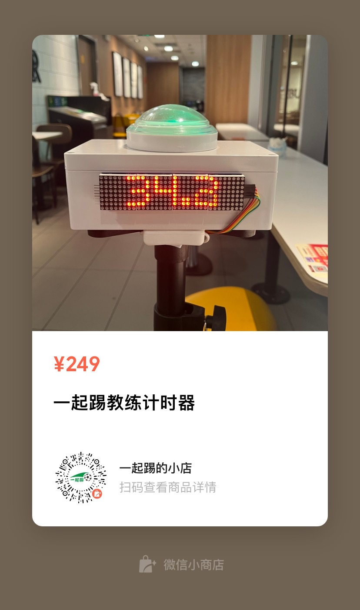

# 指南

## 介绍

IORI 计时器是一个简单易用的计时器，可以快速协助教练完成队员的测试评估。也可以作为个人训练的强大辅助工具。

## 为什么做

工作之外的业余时间，我个人是组织了一个非营利的成人足球训练营，会保持一周一练。另外会不定期的给一些青少年足球俱乐部做助教。在不断的实践中一直存在如何评估队员的问题。

教练有一个重要的工作是评估，包括主观和客观的。客观就是定量的分析，在一个特定的测试项目中，比如折返跑，记录队员所用的时间。我发现传统的记录方式都特别的不方便。要么是器材昂贵需要配电脑，或者是秒表之类用纸记录，需要几个人配合。我们一直缺少一个方便有效率的工具。

因此有了这个项目，我们的目标就是给教练做一个便宜好用的计时工具。教练可以同时记录时间和视频。通过长期的数据记录分析队员的表现，及时调整训练计划。

## 快速上手

1. 打开右侧开关，屏幕随即显示 IORI 标志，按钮灯为蓝色。
2. 按住按钮超过一段时间，屏幕显示为 READY 标志，按钮灯为黄色。
3. 松开按钮，立即进入计时。屏幕显示秒表计时，按钮灯为绿色。
4. 再次按下按钮，停止计时。屏幕显示时长，按钮灯为红色。
5. 长按按钮，重新进入准备状态，按钮灯会变为蓝色再变为橙色。
6. 或者短按，则继续计时，按钮灯重新显示绿色。

## 连接手机自动录像

1. 打开 IORI 计时器
2. 打开手机的蓝牙，搜索设备名为 "IORI" 连接
3. 打开手机拍照界面，选择视频
4. 按住 IORI 按钮，视频录制开始
5. 松开 IORI 按钮，视频录制继续
6. 再次按下 IORI 按钮，视频录制停止

::: tip
连接成功后，以后每次开机都会自动连接。如果你想连接到另外一部手机，需要断开这台手机的连接或者这台手机不在连接范围内。
:::

## 连接手机抓拍

1. 打开 IORI 计时器
2. 打开手机的蓝牙，搜索设备名为 IORI 连接
3. 打开手机拍照界面
4. 按住 IORI 按钮，松开
5. 连续短按 IORI 按钮，每次按下就是一次抓拍

## 安装到三脚架

1. 从三脚架上取下托盘
2. 把 IORI 计时器放置在托盘
3. 使用附送的螺丝从下面锁紧

## 充电指导

正常情况，电池充满，可以连续使用 10 小时（电池可能有损耗，影响使用寿命）。

充电使用 Type-C 充电接口进行充电，5V1A 的充电器充满需要 3 小时。充电时默认开启工作。

## 经典测试

IORI 计时器可以完成所有的起点和结束点一致的测试。比如折返跑、T 字测试等。我们设计训练项目时，尽量安排起点和终点一致。另外 IORI 计时器可以完成时间挑战的测试，比如连续颠球最长时间、平板支撑时间等。

当然，我们也可以仅仅把它当作一个视频记录的开关工具，配合三脚架，可以很方便的进行自我训练记录。

### T 字测试

T 字测试包含冲刺、减速、横向侧滑步、后退等步伐动作，这些是足球所需要的步伐。动作标准，完成时间越短，证明有更强的运动能力。

[T 字测试指导](https://www.bilibili.com/video/BV1p34y187aF?share_source=copy_web&vd_source=5211f4704c635d72a56e387a10a3f656)

[T 字测试合集](https://www.bilibili.com/video/BV16a411M7ko?share_source=copy_web&vd_source=5211f4704c635d72a56e387a10a3f656)

### 60 个颠球挑战

完成 60 个颠球所需要的时间。球掉可以捡起继续，数量继续累积，直至达到 60 个。

## 反馈您的建议

[吐槽的好，有礼品。](https://support.qq.com/product/422185)

## 官方购买渠道

